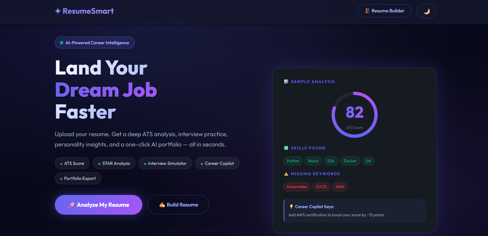
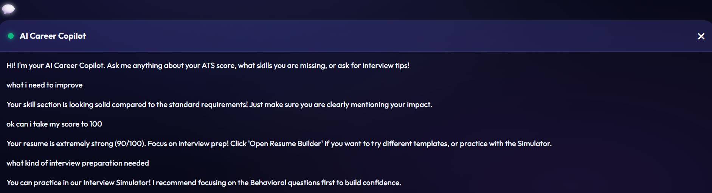

# ✨ ResumeSmart Premium AI

**The Ultimate AI-Powered Career Ecosystem**

ResumeSmart is a production-ready, highly advanced career assistant that upgrades the traditional resume analyzer into a comprehensive career platform. It leverages deep NLP (via spaCy), a robust multi-strategy PDF parser, and an innovative "Deep Midnight" glassmorphism dashboard to help professionals land their dream job safely and successfully.


<div align="center">
  <br>
  <!-- USER: Replace 'dashboard.png' with your actual screenshot filename in the images folder -->
  
  <br><br>
  
</div>

---

## 🚀 Premium Features

*   **📊 Deep ATS Analysis**: Simulates real ATS rejection reasons based on missing skills, formatting issues, and low quantifiable impact.
*   **⭐ STAR Method Analyzer**: NLP-driven evaluation of each resume bullet point to ensure it contains Situation, Action, and Measurable Result (STAR). Highlights specific weak points for targeted revision.
*   **🧠 Personality Profiling**: Evaluates sentence structures and word choice to map out your core professional traits (Leadership, Innovation, Execution, Analytical, Collaboration).
*   **👁️ Recruiter Heatmap**: Visualizes the F-pattern reading behavior of recruiters directly over your resume text.
*   **🛡️ Job Description Trust Scanner**: Uses security patterns to scan pasted job descriptions for phishing links, scam tactics, and professional red flags.
*   **💬 Career Copilot Chatbot**: A persistent AI companion in your dashboard that provides on-the-fly career advice and missing skill roadmaps.
*   **🎤 Interactive Interview Simulator**: Generates role-tailored technical and behavioral questions based on your specific resume context. Evaluates your typed answers for confidence, clarity, and relevance.
*   **🌐 1-Click Portfolio Exporter**: Seamlessly converts your optimized resume into a sleek, deployable static HTML/CSS personal portfolio.
*   **📄 Bulletproof PDF Parsing**: Avoids standard parsing crashes by cascading through 3 robust engines: `pdfplumber` ➔ `PyPDF2` ➔ `pdfminer`.

---

## 🎨 UI/UX Excellence

We care about aesthetics just as much as algorithms. ResumeSmart runs exclusively in a **Deep Midnight Glassmorphism** theme by default. Be greeted by deeply saturated indigo gradients, glowing interactive components, neon skill badges, and a meticulously crafted premium layout.

<div align="center">
  <br>
  <!-- USER: Replace 'chatbot.png' with your actual screenshot filename in the images folder -->
  
  <br>
</div>

---

## 🛠️ Project Architecture

```plaintext
ResumeSmart/
├── app.py                 # Core routing, rendering, caching, API endpoints
├── services/              # Premium AI Modular Logic
│   ├── parser.py          # Advanced multi-strategy PDF extraction + Section slicing
│   ├── analyzer.py        # spaCy NLP, STAR method, ATS scoring
│   ├── generator.py       # Portfolio HTMl generator & targeted resume improvements
│   ├── simulator.py       # Interview question generator and response evaluator
│   ├── security.py        # Phishing link & job scam NLP analysis
│   └── copilot.py         # Chatbot interactions and roadmap generator
├── resume_generator.py    # Classic PDF Resume export
├── static/
│   ├── css/style.css      # Deep Midnight Design, Animations, Grid layouts
│   └── js/premium.js      # Chat logic, Simulator logic, dynamic events
└── templates/
    ├── index.html         # Landing page (Drag/drop)
    ├── result.html        # Premium Analytics Dashboard
    └── builder.html       # Initial Custom Resume Builder
```

---

## ⚙️ Installation & Usage

### 1. Prerequisites
- **Python 3.9+** is required.
- Requires network access for `en_core_web_sm` model download (or pre-install via spaCy).

### 2. Setup

Clone the repository and install dependencies:

```bash
git clone https://github.com/yourusername/ResumeSmart.git
cd ResumeSmart

# It is highly recommended to use a virtual environment:
python -m venv venv
venv\Scripts\activate   # For Windows
source venv/bin/activate # For macOS/Linux

pip install -r requirements.txt
```

### 3. Launching

**Windows Users:**
Simply double-click the included `run.bat` script!

**Terminal/CLI:**
```bash
python app.py
```

The application will be live at `http://127.0.0.1:5000`

---

## 🛡️ Degradation & Fallbacks
If you are running ResumeSmart on a lightweight machine or cannot install `spaCy` (due to compiler limitations), the application will **gracefully degrade**. The system automatically falls back to sophisticated Regex patterns for STAR analysis and basic ATS computations, preventing sudden crashes and ensuring you always get results.

---

## 🤝 Contributing
Want to add a new AI module to the ecosystem?
1. Create your logic inside the `services/` namespace.
2. Hook your API endpoints into `app.py`.
3. Wire the UI interactions in `static/js/premium.js`.
4. Ensure components follow the `glass-card` styling in `style.css`.

---
*ResumeSmart — Built to help you land your dream job. Developed by AARTHI V G.*
